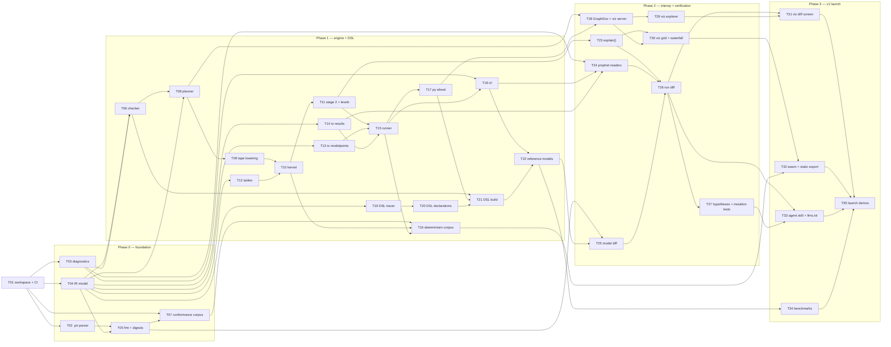

# 00 — Build backlog

Status: **planning artefact**, not normative. Derived from `01-ir.md` … `05-viz.md` and `ROADMAP.md`.
Audience: whoever (human or agent) is picking up the next piece of work.

This is the work-splitting map. Specs 01–05 say *what* to build; this says *in what order*, *what
blocks what*, and *what can be built at the same time by separate agents without stepping on each
other*.

Two rules make the parallelism real rather than notional:

1. **A task is parallelizable only if its contract is already written down.** Every `yes` below
   points at a spec section that fully determines the task's inputs and outputs. If an agent would
   have to invent a schema to finish, the answer is `no` and the schema decision is its own task.
2. **A task owns files, not features.** Tasks are scoped to crate or directory boundaries so two
   agents working concurrently touch disjoint paths. Where two tasks must share a file, they are
   sequenced instead.

---

## 1. The dependency graph

The shape worth noticing: the graph has **one root (T01)** and then fans out to four largely
independent columns — parser/IR, engine kernel, DSL, and Prophet readers — which only rejoin at the
run-diff (T26). That fan is the parallelism budget. It is widest during Phase 1, where five agents
can work at once without contention, and narrowest at T26, which is the single most load-bearing task
in the project and should be done by one agent with the whole verify spec in context.

---

## 2. The backlog

Size: **S** ≈ a day, **M** ≈ a few days, **L** ≈ a week or more of focused work.
Parallel: can a separate agent take this concurrently with its siblings, given only the spec?

| # | Task | Spec ref | Depends on | Phase | Size | Parallel |
|---|---|---|---|---|---|---|
| T01 | Cargo workspace with the nine crates of `03-engine.md` §1, dependency-rule CI check (`cargo-deny` + `#![forbid]` lints), `rust-toolchain.toml` pin, `cargo fmt/clippy/test` in CI alongside the Python job | 03 §1; ROADMAP P0 | — | 0 | S | no (root) |
| T02 | `predictable-syntax`: `logos` lexer, hand-written recursive-descent `.pir` parser, `SourceMap`, `ExprArena` with `u32` ids and a span side table, error recovery yielding multiple diagnostics per pass | 01 §4.2; 03 §2.1 | T01 | 0 | L | yes |
| T03 | Diagnostics infrastructure: `{code, severity, message, spans, suggestions, doc_url}`, `annotate-snippets` terminal rendering, `--json`, byte-range suggested edits, and the code registry (`E0/W0/E1/W1/P0/N0/H0`) with a CI check that every emitted code has a docs anchor | 01 §7; 02 §10; 04 §8.3 | T01 | 0 | M | yes |
| T04 | `predictable-ir`: the data model of `01-ir.md` §2 as serde types — `Component`, `Kind`, `Shape`, `DType`, `Unit`, `Timing`, `Expr`, tables, modelpoint schema, timeline, enums, `meta` — plus the lossless `pir.json` encoding and its front end | 01 §2, §4, §5, §11.1 | T01 | 0 | M | yes |
| T05 | `predictable fmt`: canonical form (fixed key order, expression normalisation, Ryū floats, LF/UTF-8), proven idempotent; `model_digest` / table digests computed over canonical text | 01 §4.1, §9.6 | T02, T04 | 0 | M | yes |
| T06 | Checker passes 1–6: resolve (with Levenshtein suggestions per namespace), cycles over `G₀` and `G_init` (`E0201`/`E0202`), shape lattice, dtype + unit + lookup arity, lints `W01xx`. Every diagnostic carries a suggested edit | 01 §3.1, §7 | T04, T03 | 1 | L | no |
| T07 | Conformance corpus: hand-written `.pir` modules covering every construct, each paired with expected canonical form and expected diagnostics. Authored from the spec, **before** the checker exists, so it is a specification test rather than a snapshot of behaviour | 01 §6; 03 §7.7 | T01 | 0 | M | yes |
| T08 | Planner: slot allocation by shape, Kahn with the `(module_path, declaration_index)` min-heap, `order_digest`, retention analysis (`Ring`/`Full`), loop-invariant hoisting, IEEE-preserving constant folding with `--O0` and differential tests | 03 §3.1–3.5, §4.3 | T04, T06 | 1 | L | no |
| T09 | Tape lowering: the `Op` set, linear-scan register allocation, `Select` with static trap masking for untaken `If` arms, three-tape loop peeling for the origin | 03 §3.3, §5.2; 01 §2.6 | T08 | 1 | L | no |
| T10 | Kernel: chunked column-major evaluation (`series_buf[slot][t_ring][c]`), `ChunkBuffers` arena reuse, per-lane `TrapFlags` with scalar diagnostic replay, `--max-errors` | 03 §4, §5.1, §5.5 | T09, T12 | 1 | L | no |
| T11 | Stage 2: `Reduce` / `Npv` strictly sequential in `t`, substage levelling for the stage-2 → `init` back-channel, `W0110` on > 3 levels | 03 §5.3; 01 §8.2 | T10 | 1 | M | no |
| T12 | Table loading and compilation: digest check, per-policy structures (dense vector, perfect hash, sorted + binary search, lerp), cartesian dense array under 2²⁴, `on_missing` handling | 01 §2.9; 03 §6 | T04 | 1 | M | yes |
| T13 | `predictable-io` inbound: `ModelpointSource` trait with Parquet (column pruning), CSV, Arrow implementations; schema validation against the IR before row 1 | 01 §2.10; 03 §6 | T04 | 1 | M | yes |
| T14 | `predictable-io` outbound: the long-format results schema, `results.schema.json`, Parquet/Arrow writer emitting in `(chunk_idx, offset)` order, `manifest.json` | 04 §2, §6 | T04 | 1 | M | yes |
| T15 | `predictable-runner`: chunk pipeline, rayon `LocalExecutor` behind the `ChunkExecutor` trait, `[[solve]]` Brent outer loop, `[[aggregation]]` monoid stage, manifest assembly, cancel flag | 03 §5.4, §8.2, §10; 01 §8.3 | T11, T13, T14 | 1 | M | no |
| T16 | Determinism harness: golden corpus run on x86-64 Linux, aarch64 macOS and wasm32 under wasmtime with byte equality; no-FMA test, vendored `libm`, `run(C=1) ≡ run(C=1024)` property test | 03 §7 | T10, T15, T07 | 1 | M | yes |
| T17 | `predictable-py`: PyO3 surface (`Program`, `check`, `Plan`, `Run`), Arrow C Data Interface zero-copy both ways, `Python::allow_threads`, error hierarchy, maturin abi3 wheels in CI | 03 §8 | T15 | 1 | M | no |
| T18 | `predictable-cli`: `check`, `run`, `fmt`, `build`, `diff`, `explain`, `graph`, `export`, `rerun`, `migrate`; uniform `--json`, exit codes 0/1/2 | 04 §7; 05 §1.4 | T15, T03 | 1 | M | yes |
| T19 | DSL tracer: `ExprProxy`, operator overloads, `__bool__`/`__iter__` refusals, local-variable inlining, the `E12xx` catalogue with worked messages | 02 §2.3, §2.4, §8.2, §10 | T04 | 1 | L | yes |
| T20 | DSL declarations: `@series`/`@per_mp`/`@scalar`, `ModelPoint`, `Enum`, `assumption`, `table`, `timeline`, `product`, and the library layer (`extends`, `@override`, `@abstract`, `@final`, `name_suffix`) | 02 §2–§7 | T19 | 1 | M | no |
| T21 | `predictable build [--check]`: emit canonical `.pir`, compute table digests, build the Python↔`.pir` span map into `meta.origin_span`, shell out to the engine checker in-process and re-render IR diagnostics against Python source | 02 §8; 01 §11.1 | T20, T06, T17 | 1 | M | no |
| T22 | Reference models in the DSL and as committed `.pir`: `term_annual`, `term_monthly`, `savings_monthly`, `ifrs17_gmm`, `term_solve` — the corpus every downstream task tests against | 03 §11.2; 01 §6 | T21, T18 | 1 | L | no |
| T23 | `explain()`: recording evaluator as single-modelpoint replay, closed node-variant set, `resolution` tags, `N0xxx` notes, deterministic `.text` rendering, `E0901` replay-divergence assertion | 04 §3 | T11 | 2 | L | no |
| T24 | Prophet readers in `predictable-prophet`: `.MPF`, `.fac`, `.rpt`, each a pure `bytes -> (Value, [Diagnostic])` with `P0xxx` codes and byte-offset spans; fuzzed to never panic | 04 §4 | T03, T14, T18 | 2 | L | yes |
| T25 | Model diff: AST-level structural diff over the arena, rename detection, change classification (`formula\|timing\|unit\|dtype\|shape\|init\|doc-only`), transitive impact set | 01 §11.3 | T05, T22 | 2 | M | yes |
| T26 | Run diff: alignment under `mapping.toml`, tolerance profiles and per-unit/per-component overrides, earliest divergence, root vs inherited classification, contribution ranking, `diff.json` + terminal render | 04 §5.1–5.4, §5.6 | T24, T25, T23 | 2 | L | no |
| T27 | Hypothesis detectors `H0101`–`H0501` with evidence and `suggested_edit`; the seeded-mutation harness that measures root-cause hit rate and publishes it | 04 §5.5, §9.2 | T26 | 2 | M | no |
| T28 | `GraphDoc` + `predictable graph --json` (from the planner's own ordering, never recomputed), and the viz server: `DataSource` contract, axum on 127.0.0.1 with a token, Arrow IPC transport, conformance suite | 05 §1.1, §1.2, §2.1 | T08, T17 | 2 | M | yes |
| T29 | Screen 1, Model Explorer: ELK layered layout in a worker with a digest-keyed layout cache, Canvas/SVG renderer split, inspector, impact overlay, `Cmd-K` palette including Prophet variable names | 05 §2, §4.1 | T28 | 2 | L | yes |
| T30 | Screen 3, drill-down: virtualised modelpoint grid, `explain()` panel rendering the trace tree verbatim, cashflow waterfall with timing glyphs, TSV copy | 05 §3.1, §3.4, §4.3 | T28, T23 | 2 | M | yes |
| T31 | Screen 2, Run Diff: manifest reconciliation banner, attribution panel from the model diff, contributor bars, cohort detection, side-by-side modelpoint traces | 05 §4.2 | T29, T26 | 3 | L | no |
| T32 | `predictable-wasm` + static HTML export: size budget, wasmtime determinism gate, single-file governance pack with inlined Arrow, on-demand `explain()` in the browser, sensitivity fans | 03 §9; 05 §1.4, §1.5, §3.3 | T30, T16 | 3 | M | no |
| T33 | `skills/predictable-migration/` (SKILL.md, references, `loop.py`), `llms.txt` + generated `llms-full.txt`, diagnostics index with per-code anchors, CI link check | 04 §8 | T26, T27 | 3 | M | yes |
| T34 | `predictable-benchmarks` repo: four implementations per scenario, the correctness gate that must pass before any timing is published, scaling curves, published table | 03 §11 | T22 | 3 | M | yes |
| T35 | Launch: AI migration screencast, IFRS 17 sample valuation, docs site, PyPI wheels, v0 retired to legacy | ROADMAP P3 | T31, T32, T33, T34 | 3 | M | no |

---

## 2a. Status — Phase 0 complete (integration gate passed 2026-08-17)

| # | Status | Note |
|---|---|---|
| T01 | **done** | Cargo workspace with 7 crates, toolchain pin, workspace lints; `cargo test --workspace` green. |
| T02 | **done** | `predictable-syntax`: logos lexer, recursive-descent `.pir` parser, `SourceMap`, `ExprArena` with span side table, multi-diagnostic error recovery. |
| T03 | **done** | `predictable-diagnostics`: `{code, severity, message, spans, suggestions, doc_url}`, terminal + `--json` rendering, byte-range edits, code registry with docs-anchor check. |
| T04 | **done** | `predictable-ir`: serde model of IR §2 plus the lossless `pir.json` encoding and its front end. |
| T05 | **done** | `predictable-fmt`: canonical form (fixed key order, Ryū floats, LF/UTF-8), proven idempotent; `model_digest` / table digests over canonical text. |
| T07 | **done** | Conformance corpus: 29 cases (8 valid, 21 invalid), 50 `.pir` files, `index.toml` + `check_corpus.py` self-check; authored from the spec ahead of the checker. |

Phase 0 integration gate results: 176 Rust tests passing workspace-wide, 0 failures; corpus
49/50 `.pir` files format to their expected canonical form and are idempotent (the 50th,
`invalid/e08-forward-reference/model.pir`, is `fmt = false` by design — it must not parse);
`mkdocs build --strict` clean. One cross-crate fix was needed: `predictable-py` emitted both
`cdylib` and `rlib` under the lib name `predictable_engine`, which collides with the
`predictable-engine` crate's own rlib and broke rustdoc with `E0464`; it is now `cdylib` only.

Unblocked next (Phase 1), all five runnable concurrently on disjoint paths: **T06** (checker),
**T12** (tables), **T13** (io modelpoints), **T14** (io results), **T19** (DSL tracer). Everything
else in Phase 1 is still gated — T08 on T06, T15 on T11/T13/T14, T18 on T15.

---

## 2b. Status — Phase 1 complete (integration gate passed 2026-08-17)

| # | Status | Note |
|---|---|---|
| T06 | **done** | `predictable-check`: resolve with Levenshtein suggestions, `G₀`/`G_init` cycles (`E0201`/`E0202`), shape lattice, dtype/unit/lookup arity, `W01xx` lints, suggested edits. |
| T08 | **done** | `predictable-plan`: shape slot allocation, Kahn on the `(module_path, declaration_index)` min-heap, `order_digest`, `Ring`/`Full` retention, hoisting, IEEE-preserving folding with `--O0`. |
| T09 | **done** | `predictable-tape`: `Op` set, linear-scan register allocation, `Select` with static trap masking, three-tape origin peeling. |
| T10 | **done** | `predictable-engine` kernel: chunked column-major `series_buf[slot][t_ring][c]`, `ChunkBuffers` arena reuse, per-lane `TrapFlags` with scalar replay, `--max-errors`. |
| T11 | **done** | Stage 2 `Reduce`/`Npv` sequential in `t`, substage levelling for the stage-2 → `init` back-channel, `W0110` beyond 3 levels (`engine/src/levels.rs`). |
| T12 | **done** | `predictable-tables`: digest check, dense vector / perfect hash / sorted+binary-search / lerp, cartesian dense under 2²⁴, `on_missing`. |
| T13 | **done** | `predictable-io` inbound: `ModelpointSource` over Parquet (column pruning), CSV, Arrow; schema validated against the IR before row 1. |
| T14 | **done** | `predictable-io` outbound: long-format results, `results.schema.json`, Parquet/Arrow writer in `(chunk_idx, offset)` order, `manifest.json`. |
| T15 | **done** | `predictable-runner`: chunk pipeline, rayon `LocalExecutor` behind `ChunkExecutor`, `[[solve]]` Brent outer loop, `[[aggregation]]` monoid stage, manifest assembly, cancel flag. |
| T16 | **done** | `predictable-determinism`: golden corpus, float contract test, `run(C=1) ≡ run(C=1024)` chunk-invariance property test. |
| T17 | **done** | `predictable-py`: PyO3 `Program`/`check`/`Plan`/`Run`, Arrow C Data Interface both ways, `allow_threads`, error hierarchy; 35 pytest cases. |
| T18 | **done** | `predictable-cli`: `check`, `fmt`, `digest`, `build`, `run`, `graph`, `export`, `rerun` with uniform `--json` and exit codes 0/1/2. `diff`/`explain`/`migrate` are stubs deferred to Phase 2 as specced. |
| T19 | **done** | DSL tracer: `ExprProxy`, operator overloads, `__bool__`/`__iter__` refusals, local inlining, `E12xx` catalogue. |
| T20 | **done** | DSL declarations: `@series`/`@per_mp`/`@scalar`, `ModelPoint`, `Enum`, `assumption`, `table`, `timeline`, `product`, plus `extends`/`@override`/`@abstract`/`@final`/`name_suffix`. |
| T21 | **done** | `predictable build [--check]`: canonical `.pir` emission, table digests, Python↔`.pir` span map into `meta.origin_span`, IR diagnostics re-rendered against Python source. |
| T22 | **done** | Reference models: `term_annual`, `term_monthly`, `savings_monthly`, `ifrs17_gmm`, `term_solve` under `models/`, each with DSL source, committed canonical `.pir`, fixtures, run config and goldens; 56 corpus tests. |

Phase 1 integration gate results, all on aarch64 macOS:

- **Rust:** `cargo test` (workspace default members) — **520 passing, 0 failing**; `cargo test -p
  predictable-py` with `PYO3_PYTHON` set links and passes. `cargo fmt --check` and `cargo clippy
  --all-targets` are both clean after this gate (one `unnecessary_min_or_max` in
  `predictable-syntax/src/raw.rs` fixed, whole tree reformatted).
- **Python:** `packages/predictable` — **278 passing**; `crates/predictable-py/tests` — **35
  passing**; `models/tests` — **56 passing, 1 xfail, 1 xpass**; `conformance/check_corpus.py` — 29
  cases, 0 problems. Total **369 Python tests**.
- **Docs:** `mkdocs build --strict` clean; all 19 `docs/v2/*.md` pages are reachable from the nav.
- **End-to-end:** `predictable run run.pir --out runs/smoke` in `models/term_annual` completes,
  projects 25/25 modelpoints with 0 traps into 7325 result rows, and `models/tools/goldens.py`
  reports **zero differences** against `models/term_annual/expected/`.

Two structural notes for Phase 2. (1) `cargo test --workspace` still fails on `predictable-py`,
which links whatever interpreter `PYO3_PYTHON` names and otherwise falls back to Xcode's
python3.9; the workspace `default-members` list deliberately excludes it, so use plain `cargo
test` plus an explicit `cargo test -p predictable-py`. (2) `results.parquet` **bytes** used to vary
with `--chunk-size` on the larger models even though every value was identical — a Parquet
*encoding* determinism gap in T14/T15. **Closed 2026-08-17:** the writer drains Arrow batches in
exact `batch_rows` slices and pins every layout knob to a row count, the xfail in
`models/tests/test_reference_models.py` is now a strict test over all five reference models
(plus a `--threads` twin), and the goldens for `term_monthly`, `savings_monthly` and
`ifrs17_gmm` were regenerated (`results_digest` only; no value moved). Docs:
`docs/v2/parquet-determinism.md`. The same commit pins the docs toolchain as a PEP 735
`docs` dependency group in `pyproject.toml` (`uv run --group docs mkdocs build --strict`), so
T32's wasm determinism gate and T26's run diff can both rest on file bytes if they choose to.

Phase 2 (T23–T30) is closed; see §2c for what landed and for the integration gate.

Unblocked next (Phase 3): **T31** (Screen 2, Run Diff — gated on T29+T26, both done; it is the UI
face of the localisation the verification walkthrough now rehearses on the command line),
**T32** (`predictable-wasm` + static HTML export — on T30+T16, both done; `predictable export`
already emits the single-file pack, so T32 is the wasm engine, the size budget and the wasmtime
determinism gate rather than a new format), and **T33** (`skills/predictable-migration/`,
`llms.txt` / `llms-full.txt`, the diagnostics index and the CI link check — on T26+T27, both done).
T31 and T32 both touch `crates/predictable-viz/frontend`, so they are *not* disjoint: T31 owns
`src/rundiff/` and T32 owns the build and the wasm `DataSource`, and they must agree on
`datasource.ts` before either starts. T33 is disjoint from both and can run concurrently with
either.

---

## 2c. Status — Phase 2 complete

Phase 2 is closed. T23–T30 are all delivered and the integration gate below has been run.

| # | Status | Note |
|---|---|---|
| T23 | **done** | `explain()` in `predictable-engine`: a recording evaluator that replays a single modelpoint rather than instrumenting the hot kernel, so the projection path is unchanged and `E0901` asserts the replayed value equals the value the run wrote. Closed node-variant set, `resolution` tags (`modelpoint` / `assumption[set]` / `table` / `builtin` / `init` / `ring`), `N0xxx` notes (`N0302` "used its `init` at t = 0" is the one the walkthrough turns on), deterministic `.text` rendering with `--depth`, `--expand`, `--values-only`, `--trace-max-terms`, `--width`. CLI `predictable explain <run/> --component --mp [--t]`, plus the Python `results.explain(...)` binding. 17 `tests/explain.rs` cases + the `crates/predictable-py/tests/test_explain.py` and `models/tests/test_explain.py` suites. Docs: `docs/v2/explain.md`. |
| T24 | **done** | `predictable-prophet`: `.MPF`, `.fac`, `.rpt` readers, each a total `bytes -> (value, [Diagnostic])` with `P0xxx` codes and byte-offset spans into the original file; Windows-1252 fallback; `P0110`/`P0111`/`P0305` added to the registry; proptest fuzzing (arbitrary bytes, Prophet-shaped noise, generated round-trips) asserts no panic and in-bounds spans; `write_run_dir` turns a `.rpt` into a first-class run directory (`results.parquet` + `manifest.json` with `system = "prophet"`). 41 Rust tests + 2 doctests. Docs: `docs/v2/prophet-readers.md`. The CLI `prophet` subcommands and `migration/mapping.toml` parsing are left to their owners; `RptOptions` already carries `period_base`, `mp_key_column` and the component name map.

| T25 | **done** | `predictable-modeldiff`: AST-level structural diff over the IR expression trees, anchored at `ExprPath` (§3.0.1) so anchors survive `fmt`; node changes typed (`operator`/`offset`/`reference`/`literal`/`function`/`table`/`aggregate`/`predicate`/`arity`/`replaced`); component classification `formula|init|timing|unit|dtype|shape|kind|doc-only` (`kind` added beyond §11.3's seven, since emission is a model property, Q2); rename detection by `meta.id` then normalised `expr`+`unit`+`shape`, ambiguity reported as add+remove, and side A read *through* the rename so one rename is not a formula change in every dependent; table declaration + CSV row-level diff joined on the declared key columns; assumption declaration and value changes; transitive impact set over the union of both sides' edges with `seeds`/`impacted`/`outputs_affected`. CLI: `predictable diff model A B [--json] [--out-json p] [--fail-on-change]` (a difference exits 0; the gate is opt-in and ignores pure renames and doc-only edits); `predictable diff runA runB` remains T26's stub. 33 Rust tests (23 unit, 9 against constructed `term_annual` variants, 1 doctest) + 6 CLI tests. Docs: `docs/v2/model-diff.md`.

| T26 | **done** | `predictable-rundiff`: one reader for both sides (a Prophet import is a run directory, so there is no Prophet-specific comparison path); alignment on `(mp_key, component, t)` under `mapping.toml` with `sign`/`scale`/`timing_shift` applied to the non-predictable side and printed in the header; the §5.6 predicate in one place, four named profiles, per-unit and per-component overrides, and a source-precision raise scaled by the mapping's `scale` — every *loosening* printed, listed in `tolerance.overrides_applied`, and filed as its own `tolerance-only` finding with the cell count it absorbed; earliest divergence per component with the deterministic exemplar rule (lowest `mp_row` at `t_first`, `t = -1` never counted as the earliest *timestep*); root vs inherited from the IR graph with the lag on each edge, reported with a `class_basis` (`ir_graph` / `partial_graph` / `no_graph_earliest_t`) so the claim is falsifiable, and each side's model digest verified before it is used to classify; `explained_by_model_change` cross-references `predictable-modeldiff` over modules *and* the assumption set, with unexplained roots promoted; contribution ranking by signed delta share of the largest-moving output, `method` stated; `emit_mismatch` per Q6 (diff the intersection; `--require-same-emit` restores exit 2); `diff.json` designed machine-first — the terminal render is a projection of it and prints nothing that is not also a field. CLI: `predictable diff run A B` with `--tolerance-profile/--abs/--rel/--mapping/--period-base/--top/--component/--mp/--fail-on/--require-same-emit/--explain-tolerance/--no-source-precision/--model-a/--model-b`, either side a run dir or a `.rpt` (imported via `predictable-prophet`). 45 Rust tests in the crate (16 unit, 22 seeded-divergence on `models/term_annual`, 4 Prophet-side, 3 doctests) + 12 CLI tests that run the reference model twice with one assumption changed and pin the whole localisation. `hypotheses` is always present and always empty — T27 fills it; `Finding::series_for` is the detector hook. Docs: `docs/v2/run-diff.md`.

| T27 | **done** | Hypothesis detectors `H0101`–`H0501` in `predictable-rundiff` (extending T26, not forking it): every detector is a pure function of one modelpoint's divergence vector plus read-only context (both runs' other components, the IR graph, `b`'s model and its source spans), and returns a *signature* as well as evidence — support counts modelpoints on which the detector fired with the **same** claim, so a `1/12` here and a `0.97` there never add up to confidence. Exemplar first, then a deterministic evenly-spaced sample of up to 32 further diverging modelpoints; `high`/`medium`/`low` per §5.5 scaled to the sample that existed; a claim failing on more than half the sample is dropped rather than emitted as `low`. `PerMP`/`Scalar` components have no series, so their divergence vector is taken across the *population* instead of across `t` — without that, no hypothesis about a BEL is possible. Booleans and integers are projected onto the reals, which is what makes the term-expiry and attained-age patterns visible. Precedence: `H0401`/`H0202`/`H0103` displace the generic `H0101`. `H0301` fires on both boundary kinds (key out of range, key with no row), resolving the lookup key from the run when it is a component and from the timeline when it is a builtin (`policy_year`, `policy_month`, `t`). New `suggest` module: a `SourceIndex` over the model's `.pir` files built from `parse_raw` spans (never a text search), producing `{file, byte_start, byte_end, old, new}` edits whose `old` is read from disk and re-checked by `still_applies` before application, and which convert to `predictable_diagnostics::Edit` so one agent code path applies checker and differ edits alike. Edits land in side b's source and are written to make b reproduce a. New `mutation` module: the §9.2 catalogue (14 seeded mutations across `term_annual`/`term_monthly`/`savings_monthly` — dropped lag, timing flip, `/12`, sign, offset, term off-by-one, rounding, missing table rows), the scoring, and a runner-agnostic driver taking a `run` callback; both sides run with `emit = "all"` because with only outputs emitted "which component is the root" is a fact about the emit setting. **Root-cause hit rate 14/14 = 100%, intended hypothesis fired on 11/11**, asserted by `tests/mutation_harness.rs` (which drives the real CLI) and republished by `examples/mutation_report.rs`. 12 new unit tests, 12 `tests/hypotheses.rs` behavioural tests on the reference run, 7 harness tests. Docs: `docs/v2/hypotheses.md`.
| T28 | **done** | `predictable-viz`: `GraphDoc` (`graphdoc.rs`) built from the planner's own `plan.order` — never recomputed — carrying `nodes`, `edges` (each with `lag`, `at`, `via` `ExprPath` and a source span), `layers`, and the `model_digest` / `plan_digest` / `order_digest` triple that keys the layout cache. `predictable graph <path>... --json` emits it (113 nodes / 193 edges for `ifrs17_gmm`). Server: the `DataSource` trait (`source.rs`) with `InMemoryDataSource`, axum on 127.0.0.1 with a 32-byte token carried as `?token=` or `X-Predictable-Token` — the static shell is unauthenticated, every `/api/*` route 401s without it — Arrow IPC on `/api/series` and `/api/aggregate`, and a `/api/capabilities` document so the UI greys out affordances the source cannot serve rather than offering dead ones (`predictable serve` on a model reports `explain: false`). Routes: `health`, `capabilities`, `manifest`, `graph`, `component/{name}`, `series`, `aggregate`, `explain`, `diff`. 19 Rust tests (`graphdoc.rs` 8, `conformance.rs` 9, `http_conformance.rs` 2) + `tests/server.rs`. Docs: `docs/v2/viz-server.md`. |
| T29 | **done** | Screen 1, the Model Explorer, in `crates/predictable-viz/frontend`: ELK layered layout run in a worker and cached by the `GraphDoc` digest triple, a Canvas/SVG renderer split chosen by node count, the inspector (dtype/shape/unit/timing/stage/depth/retention, `init` and `expr` with every reference a live link, declared-at span, reads/read-by, impact count), the `i` impact overlay, module/unit/kind/tag facets, layer bands, and a `Cmd-K` palette that also matches Prophet variable names. Vitest: `graph/layout.test.ts` 15, `graph/model.test.ts` 13, `graph/scene.test.ts` 15, `graph/search.test.ts` 14, `App.test.tsx` 19, `store.test.ts` 6. Screenshots for the docs are generated by `tools/screenshots.mjs` driving the real server in Playwright, never hand-captured (05 §5.4). Docs: `docs/v2/model-explorer.md`. |
| T30 | **done** | Screen 3, the modelpoint drill-down: a virtualised `ModelpointGrid` that mounts only the visible window, a `TracePanel` that renders T23's trace tree verbatim (fold state reported to the URL owner, never re-derived in the UI), and a cashflow waterfall with timing glyphs, a keyboard path, an "as a table" view with unrounded numbers, and TSV copy. Vitest: `ModelpointGrid.test.tsx` 10, `TracePanel.test.tsx` 12, `WaterfallChart.test.tsx` 10, `waterfall.test.ts` 9, `DrilldownScreen.test.tsx` 10. Docs: `docs/v2/viz-drilldown.md`. |
| gate | **done** | **Phase 2 integration gate.** Full suites green together: **758 Rust** (93 test binaries incl. doctests, workspace default members) + **`-p predictable-py` builds and links against the venv interpreter** + **443 Python** (`tests/` 33, `packages/predictable/tests/` 278, `crates/predictable-py/tests/` 47, `models/tests/` 85) + **169 frontend** (vitest, 14 files) = **1,370 tests, 0 failures**. `mkdocs build --strict` green. E2E verification-loop rehearsal recorded in `docs/v2/verification-walkthrough.md`: a premium-escalation off-by-one seeded into a copy of `models/term_annual`, both sides run, `diff run` localises to **one** root (`premium_rate` under `emit = "all"`, `premium_income` under `emit = "outputs"`) out of six diverging components, classifies the other five as `inherited` with `class_basis = "ir_graph"`, cross-references the model diff (`explained by a model change: init`), and fires `H0201 b[t] = a[t+1]` — a literal description of the seeded off-by-one — at high confidence held on 24/24 modelpoints; `explain` on both sides shows the `init` arithmetic and note `N0302`. E2E viz smoke: `predictable serve models/ifrs17_gmm/build` starts, serves the shell unauthenticated and 401s every `/api/*` route without the token, and a Playwright run against the **real** bundle and the **real** server renders 113 nodes / 185 edges, the inspector for `model.csm`, the impact overlay (`7 impacted, 7 Outputs`), 30 palette hits for `csm`, and 13 layer bands, with **zero** page or console errors. `predictable export` produces a 23.6 kB single-file governance pack with the manifest verified. |

Two notes from the gate, neither blocking:

* **The four Python suites cannot be collected in one `pytest` invocation.** The v1 package at the
  repo root and the v2 package under `packages/predictable/` are both importable as `predictable`,
  so the root shadows `packages/`. They are run as four invocations, and CI should keep doing that.
  (`--import-mode=importlib` fixes the duplicate `test_explain.py` basename but breaks the
  `from conftest import …` that two suites rely on, so it is not the answer.)
* **`emit = "outputs"` costs you one step of localisation.** "Which component is the root" is
  partly a fact about what the run was asked to write down. Diff runs should use `emit = "all"`;
  this is now stated in the walkthrough and is what the T27 mutation harness already does.

---

## 2d. Status — Phase 3 complete (release gate passed 2026-08-17)

| # | Status | Note |
|---|---|---|
| T32 | **done** | `predictable-wasm`: the engine kernel for `wasm32-unknown-unknown` (browser) and `wasm32-wasip1` (the gate), with no filesystem, no threads, no clock and no `predictable-io` — tables resolve from embedded bytes through a `PackResolver` (digest re-checked), modelpoints through a small RFC 4180 reader, and everything else is the ordinary planner/tape/kernel/`Explainer`. Surface: `version`/`check`/`plan`/`run`/`explain`/`sensitivity` over a three-function C ABI (`pv_alloc`/`pv_call`/`pv_free`, length-prefixed UTF-8) rather than `wasm-bindgen` — a pack is one file and generated glue would make its bytes depend on a `wasm-bindgen-cli` version the auditor cannot re-derive; the 30-line loader is checked in (`frontend/src/wasm/engine.ts`). **Size: 882 kB raw, 315 kB gzipped against §9's 1.5 MB budget** (`wasm-release` profile: `opt-level = "z"`, `panic = "abort"`, LTO, strip, `+simd128,+bulk-memory`; no `wasm-opt` needed). **Determinism gate** (`tests/wasm_gate.rs`) extends T16: every conformance case plus `models/term_annual` is rendered to IEEE-754 bit patterns natively and again inside wasmtime (embedded `wasmtime` 27 + WASI p1, no preopens) and the two renderings must be byte-equal — 15 cases, ~29k rendered lines, equal. `predictable export` now embeds the results as base64 Arrow IPC in a `predictable-payload` JSON island (the `InlinePayload` of `datasource.ts`), the graph document, `--include diff:<run>` documents verbatim, `--with-traces` pre-baked traces, and `--engine wasm` the engine itself with the model/tables/assumptions/sampled modelpoints it needs; `--modelpoints sample:N` is the first N in file order so a pack re-exports byte for byte. Frontend: `WasmEngine` over the ABI, `InlineDataSource.attach()` wired in `main.tsx` before first render, and a fan/tornado model built on Q12's `lineage.varied[]` with no interpolation anywhere. Tests: 9 `predictable-wasm/tests/session.rs` (bit-equality against `models/term_annual/expected/`), 3 gate tests, 7 `predictable-cli/tests/export_pack.rs` — the last of which opens the exported pack under `node`, instantiates the embedded engine through the page's own loader protocol and gets `model.reserve` back to the bit — plus 25 vitest cases in `frontend/src/wasm/`. Docs: `docs/v2/wasm-and-packs.md`. |
| T31 | **done** | Screen 2, the Run Diff, in `crates/predictable-viz/frontend/src/rundiff/`: manifest reconciliation banner (which of the six digests moved, so "the models differ" is never confused with "the assumptions differ"), the attribution panel driven by T25's model diff, contributor bars ranked by signed share of the largest-moving output, cohort detection over the diverging modelpoint set, and side-by-side modelpoint traces rendering T23's tree on both sides. All of it reads `diff.json` — the screen computes no comparison of its own. Vitest across `align`, `attribution`, `cohort`, `contributors`, `reconcile`, `mount` and `RunDiffScreen`. Docs: `docs/v2/viz-rundiff.md`. |
| T33 | **done** | `skills/predictable-migration/` (SKILL.md, `references/`, `scripts/`) — the agent loop that reads a Prophet library, writes the DSL, runs `diff run`, and iterates on the hypotheses until the verdict is `matched`; `llms.txt` (53 lines, hand-written index) and the generated `llms-full.txt` (5,675 lines); the diagnostics catalogue at `docs/llm/diagnostics.md` with a per-code anchor for every `E`/`W`/`P`/`N` code. Exercised end to end by demo 1. |
| T34 | **done** | `benchmarks/`: four implementations per scenario (predictable, a NumPy reference, `cashflower`, `modelx`/`lifelib`) across the five reference models at M = 1 … 1,000,000, with the **correctness gate first** — every engine compared against the NumPy reference on every output, every modelpoint, every period at `1e-9` scale-relative tolerance, and no timing recorded until that table is clean. Scaling curves over `--threads 1,2,4,8`. Published table regenerated by `python -m bench` into `benchmarks/results/results.{json,md}` with the environment stamped. Docs: `docs/v2/benchmarks.md`. |
| T35 | **done** | Launch: three self-asserting demo scripts under `demos/` (migration, benchmarks, IFRS 17) that exit non-zero the moment their claim stops being true; the IFRS 17 GMM sample valuation over 10,000 contracts with a self-contained governance pack; the docs site restructured (Home / Getting Started / Concepts / Reference / Demos / Design specs) with a new `docs/index.md` and `docs/v2/getting-started.md`; `RELEASE_NOTES_v2.md`. **Not done:** the migration screencast, PyPI wheels, and retiring v0 to `legacy/` — see the release notes' known gaps. |
| gate | **done** | **Phase 3 / release gate, 2026-08-17.** `cargo test --workspace` **785 passed, 0 failed**; `cargo test -p predictable-py` builds and links against the venv interpreter; four Python suites **481 passed** (`tests/` 62, `packages/predictable/tests/` 278, `crates/predictable-py/tests/` 47, `models/tests/` 94); `npm test` in the viz frontend **257 passed** (24 files) — **1,523 tests, 0 failures**. wasm determinism gate green (wasm32-wasip1 under wasmtime bit-identical to native; 882,650 B raw / 315,234 B gzipped against the 1.5 MB budget). All three demo scripts run end to end and exit 0. `mkdocs build --strict` green. |

---

## 3. Notes for multi-agent sessions

**The five-way Phase 1 split.** Once T01–T05 are in, five agents can run concurrently on: (a) the
checker T06, (b) the engine column T08→T09→T10→T11, (c) IO T12/T13/T14, (d) the DSL column
T19→T20, (e) the Prophet readers T24. They meet at T15 and T21. Keep them there — the merge cost is
low because each owns its own crate.

**Two tasks deserve a single owner with full context.** T06 (the checker) and T26 (the run diff) are
where the product's quality actually lives: the checker is the error-message surface the whole
"LLM-actionable diagnostics" thesis rests on, and the run diff is the demo. Neither should be split
across agents or done in a hurry.

**T07 before T06 is deliberate.** Writing the conformance corpus from the spec, before the checker
exists, is what stops the checker's behaviour from silently becoming the specification. The same
principle applies to T16's goldens and T27's mutation catalogue.

**The open questions in §4 are closed.** `RunConfig` (Q1), the results `emit` question (Q6) and the
`[[aggregation]]` schema (Q4) were the ones gating T15, T18, T26 and T29; all fifteen now have
normative rulings in `01-ir.md` (§13 is the decision log). T04 should read §8.3 and §8.4 before
modelling the serde types, since the `[product]` and `[run]` blocks are new file kinds it owns.

---

## 4. Open questions — all closed

**Status: resolved.** Q1–Q15 were carried from the `IR feedback` sections of specs 02–05. Every one
now has a normative ruling in `01-ir.md`, summarised one line each in that document's §13 decision
log, with the downstream specs updated in place where a ruling contradicted what they had assumed.
No task in §2 is blocked on an IR decision.

| # | Question | Ruling | Normative in |
|---|---|---|---|
| Q1 | `RunConfig` schema and `T`'s home | `[run]` block in its own `.pir`; `[timeline].periods` is the sole source of `T` (`E0101`); `run_digest` = everything that can change a number, excluding `[run.exec]` and `out` | IR §8.4.2 |
| Q2 | Does `product(...)` have an IR block? | Yes — `[product]` with `modules`, `outputs`, `key_field`, `assumptions`; the `Output` flag wins and `outputs` is a checked manifest (`E0107`) | IR §2.2, §8.4.1 |
| Q3 | Are nulls real at runtime? | No. No validity bitmap; missingness eliminated at load and at lookup; `is_null`/`coalesce` read an opt-in presence bit, `E0602` elsewhere | IR §2.11 |
| Q4 | `[[aggregation]]` schema | `{name, group_by, measure, op, weight, filter, over_t}` in the run file; groupings **do not nest** — drill-down is prefixes of the ordered key tuple | IR §8.3 |
| Q5 | Table `source` resolution | Relative to the declaring `.pir`, sandboxed to the project root (`E0801`); `TableResolver` with `FsResolver` / `MapResolver` (`resource:`) / `InlineResolver`; digest is identity | IR §2.9.1 |
| Q6 | `--emit all` and structural comparability | `emit` enters `run_digest`; `results.component_set_digest`; `emit_mismatch` is a named diff condition that compares the intersection, never `exit 2` unless `--require-same-emit` | IR §8.4.3 |
| Q7 | Trap reporting envelope | `E0902` JSON envelope; `on_trap = "abort"` default (manifest, no results, exit 2); `continue` drops the modelpoint entirely (no null rows), exit 1; `manifest.execution.outcome` | IR §9.3.1 |
| Q8 | `[[solve]]` manifest contract | Converged/not-converged counts, iteration stats, max residual + its modelpoint, `solves/<name>.parquet` per modelpoint, solved value also a `PerMP` component | IR §8.4.4 |
| Q9 | `ExprPath` syntax | Dotted field path from `expr`/`init`: `lhs rhs operand cond then else arg<i> key<i> value pred`; canonical-form derived, reformat-stable | IR §3.0.1 |
| Q10 | `@abstract` in the IR | DSL/build-time only; no `Kind::Abstract`; undischarged abstract is `E1203` before any `.pir` is written | IR §2.2 |
| Q11 | `Agg` per-`t` contributions in traces | Required, not optional: ascending `t`, exact left-to-right sum, `disc` + `timing_used` for `npv`, `--trace-max-terms` truncates loudly | IR §11.2 |
| Q12 | Sensitivity lineage | `lineage = {parent_run, parent_manifest_digest, group_id, label, varied[]}` on every manifest; fans grouped by `group_id`, never by filename | IR §9.4.1 |
| Q13 | Does table content travel with results? | Yes — `run/tables/<name>.parquet` + `copy_digest` from the same bytes that were hashed; `--no-table-copy` opts out and consumers must say so | IR §9.4.1 |
| Q14 | `retime()` on an `npv` result | Lint, not a semantic change: `Agg` results are untimed; `retime`/`shift`/`cum`/`diff` on an untimed value is `W0105` | IR §2.5 |
| Q15 | Output-only `f32` storage | Deferred to IR 1.1, key reserved now: `run.storage_precision` accepts `"f64"` only, `"f32"` is `E0108`; T14 writes `double` unconditionally | IR §8.4.5 |

New diagnostic codes these rulings introduce — `E0101`, `E0105`–`E0108`, `E0402`–`E0404`, `E0602`,
`E0801`, `E0902`, `E0903`, `W0105`, `E1203` — are listed at the end of `01-ir.md` §13 and are T03's
to register.
