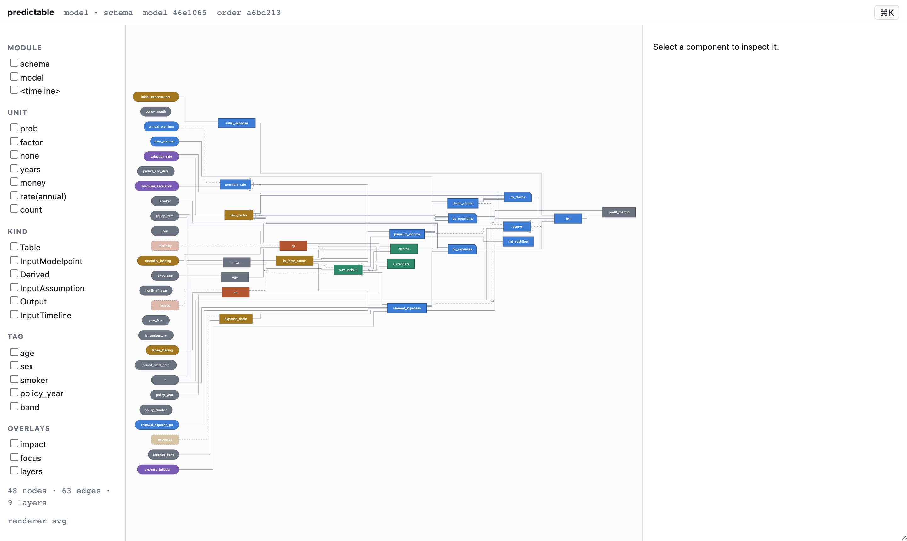
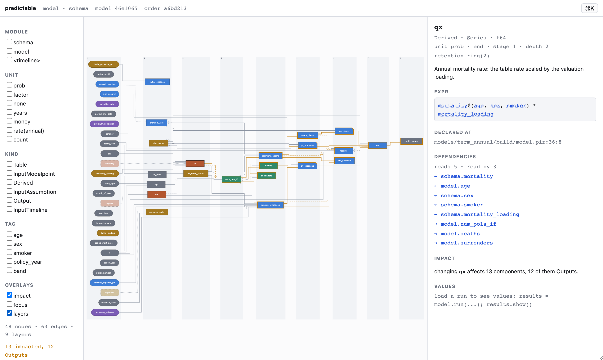
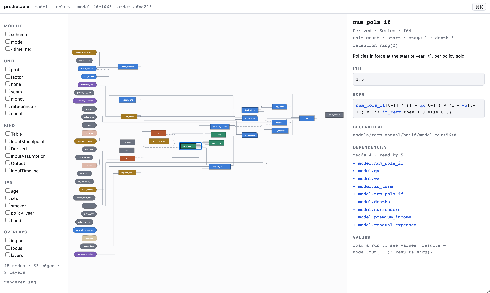
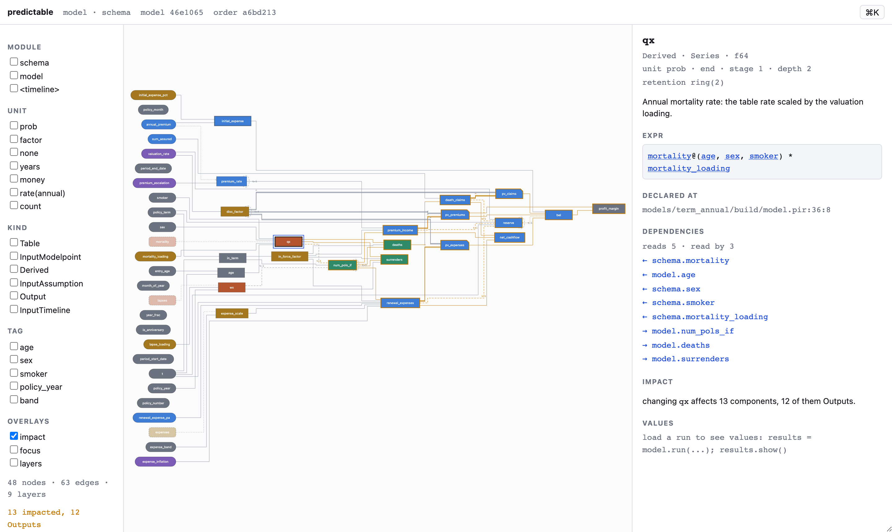
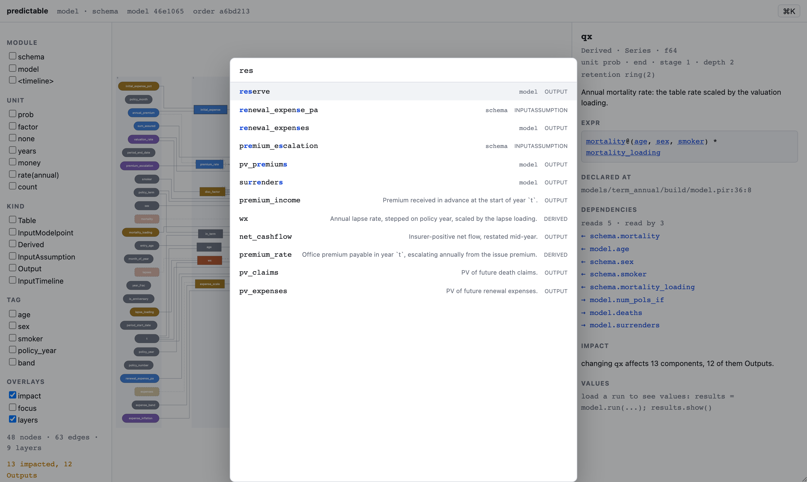

# The Model Explorer

The Model Explorer is Screen 1 of the viz layer (`05-viz.md` §2, §4.1): the picture of the model
you keep open while you migrate or review one. It renders the **planner's own ordering** — nothing
on this screen recomputes a dependency, a topological order or an actuarial number. If the picture
and the run ever disagreed, the picture would be worthless, so the screen is built so that they
cannot.

## Opening it

```console
$ predictable serve models/term_annual/build/schema.pir \
                   models/term_annual/build/product.pir \
                   models/term_annual/build/model.pir
serving 48 components at http://127.0.0.1:7391/#4f2b…
the token is in the fragment; every API call must carry it
Ctrl-C to stop
```

`serve` plans the model, builds the [`GraphDoc`](viz-server.md) from
`Plan::order`, and serves it on loopback behind a token. It holds no results, so it reports
`explain: false` and the screen greys the trace button out instead of offering a dead one. From
Python, `model.show()` does the same thing.



Everything below is generated from `models/term_annual` by
`crates/predictable-viz/frontend/tools/screenshots.mjs`, which drives the real server with a real
browser — per §5.4, no screenshot in these docs is hand-captured.

## Reading the picture

Left to right **is** the evaluation order. ELK lays the graph out with `layered` /
`direction: RIGHT` / `NETWORK_SIMPLEX`, and every node is pinned to its engine `depth` with
`elk.partitioning.partition`, so a component drawn in the fifth column is evaluated in the fifth
layer. Turn on the **layers** overlay to see the depth bands drawn explicitly.



Shape and stroke encode IR semantics, and colour never carries information on its own:

| What you see | What it means |
|---|---|
| pill, far left | an `Input*` component — a modelpoint field, an assumption, a timeline field |
| rectangle | `Derived` |
| rectangle, heavy border | `Output` (IR §2.2 — emission is a model property) |
| rounded rectangle, dashed | a `[[table]]`, which the planner never evaluates but every reader depends on |
| clipped top-right corner | `stage = 2`: the expression contains an `Agg` |
| fill hue | the component's `Unit`. `rate(annual)` and `rate(monthly)` share a hue — same identity, different basis |
| solid edge | a same-period read, `lag = 0` |
| dashed edge, labelled `t-k` | a lagged read, `x[t-k]` |
| dotted edge, labelled `[k]` | an absolute `At(x, k)` seed edge |
| double stroke, labelled `⇒` | a stage-2 whole-series edge |
| dotted edge with a dot at the target | an `init` read of a stage-2 value — the one legal backward channel (IR §8.2) |
| dashed arc on the node itself, labelled `t-1` | the component reads *itself* at a lag |

That last row is the one that earns the screen. `num_pols_if[t-1] * (1 - qx[t-1]) * …` is the
formula every reader of an actuarial model has to hold in their head; here the recursion is a
visible loop-back arc on the node, not a substring of a string.

Above 300 visible nodes the renderer switches from SVG to Canvas 2D. Both consume the same
`Scene`, so the two backends draw the same picture; the sidebar tells you which one is live.

## The inspector

Click any node.



The panel shows the declared metadata (`kind`, `shape`, `dtype`, `unit`, `timing`, stage, depth),
the planner's retention decision (`ring(2)` here — the engine keeps two periods of this series, not
all of them), the doc comment, `init` and `expr` **as written** rather than re-printed from the
tree, the `.pir` span, the checker's lints, and the dependency lists.

Two things in there are not decoration:

- **Every identifier in `expr` is a link to its own node.** Reading a formula and jumping to a
  dependency is the single most common action on this screen.
- **`reads` / `read by` come from the server**, i.e. from the planner's edges — not from a local
  re-scan of the expression text.

With no run loaded, the values section is an empty state and not an error:
*"load a run to see values: `results = model.run(...); results.show()`"*.

## The impact overlay

Select a node and press **`I`**, or tick *impact* in the sidebar. The transitive downstream closure
lights up in amber and the sidebar counts it.



> changing `qx` affects 13 components, 12 of them Outputs.

That is the sentence you want before you change an assumption, and it is computed over the edges
the planner emitted. A self-referential component is *not* counted as impacting itself, so the
number means "how many other components move".

**Focus mode** (double-click a node, or tick *focus*) is the complementary tool: the subgraph within
two hops each way stays fully drawn and everything else drops to 8% opacity. Context is dimmed,
never removed — and dimmed nodes stop being click targets, so you cannot select something you can
barely see.

## `⌘K`, and finding a Prophet variable

`⌘K` (or `Ctrl-K`) opens the command palette over component names, modules, tags, doc comments,
expressions **and Prophet variable names from `meta.source`**.



Matching is a scored subsequence: earlier matches beat later ones, contiguous runs beat scattered
ones, and a hit at a word boundary — `_` and `.` count, so `NUM_POLS_IF` and `num_pols_if` are
segmented the same way — beats one in the middle of a word. Each row says *why* it matched, and a
Prophet hit is labelled as one:

```
reserve            Prophet TERM_UK.BEL_TOT      OUTPUT
```

This is the migration path in one keystroke. `BEL_TOT` and `reserve` share not one character, so
no amount of `⌘F` over the source finds it; the palette does, because the component states which
Prophet variable it came from and the inspector then shows the provenance line —
`TERM_UK.BEL_TOT`, `TERM.VAR:118`.

!!! note "Provenance needs `[component.meta]` in the `.pir` text"
    `GraphDoc` carries `source` per `05-viz.md` §2.1 and the screen reads it, but the `.pir` text
    front end does not lower `[component.meta]` yet — `COMPONENT_KEYS` in
    `predictable-syntax/src/lower.rs` rejects `meta`, so today only a `GraphDoc` built by a tool
    that fills the field in (the Prophet migration path) carries it. The Explorer degrades cleanly:
    with no `meta.source` anywhere, the palette simply indexes no Prophet keys and the inspector
    shows no provenance section.

## Filters, overlays and the URL

The sidebar filters by module, unit, kind and tag. Facets intersect; an empty facet is no
constraint. An edge is drawn only when both of its endpoints survive, so a filtered graph never
shows an edge into nothing.

Every piece of that state — selection, each facet, the overlays, the query you last typed into the
palette — is in the URL, per §5.1:

```
http://127.0.0.1:7391/?sel=model.qx&impact=1&layers=1&kind=Output&q=BEL_TOT#<token>
```

Paste that into a review comment and the reader opens exactly your screen. The token stays in the
fragment, where it is never sent to a server, and view state stays in the query string.

## Layout, and why it is cached

ELK is a solver: on a two-thousand-component Prophet library it runs for seconds, so it runs in a
Web Worker and never on the main thread. The result is cached under
`predictable.viz.layout.<model_digest>`.

The key is the model digest and nothing else, which buys two things:

1. **Opening an unchanged model is instant** — the worker is not started at all.
2. **Node positions are stable across sessions.** A screenshot in a review comment still points at
   the same boxes tomorrow. Change the model and the digest changes, so the layout is recomputed;
   a corrupt or partial cache entry is discarded rather than half-drawn.

## Accessibility, theme and print

Both themes are defined explicitly and print forces light. Every node is a focusable element with
a label reading `name, kind, shape, unit, depth` — under Canvas, an off-screen list mirrors the
scene so the graph stays keyboard- and screen-reader-navigable at two thousand nodes. Colour is
never the only channel: lag also changes the dash pattern *and* carries a text label, stage also
changes the node's corner, kind also changes its outline.

## Working on this screen

```console
$ cd crates/predictable-viz/frontend
$ npm test                    # 82 vitest cases for the explorer
$ npm run build               # writes dist/index.html, which the server embeds
$ node tools/screenshots.mjs  # regenerates docs/v2/img/explorer-*.png
```

`npm run build` must be re-run and `dist/index.html` committed whenever the frontend changes:
`predictable-viz` embeds it with `include_str!`, so `cargo build` works on a machine with no Node
installed. The bundle is one self-contained file — the ELK worker is inlined as a blob, because a
governance pack (§1.4) must fetch nothing at all.

The tests run against `src/test/fixtures/term_annual.graph.json`, which is the verbatim output of
`predictable graph models/term_annual/build/*.pir --json`. Assertions about depth, layers and edges
are therefore assertions about what the planner actually produced, which is the only way to catch
the viz layer quietly re-deriving something the engine already decided.

## See also

- [The graph document and viz server](viz-server.md) — `GraphDoc`, the `DataSource` contract, the
  token and the Arrow transport.
- [The modelpoint drill-down](viz-drilldown.md) — Screen 3.
- [Diffing two models](model-diff.md) — the source of the *changed vs run B* overlay.
