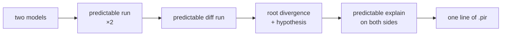

# The verification loop, end to end

Everything else in this section documents one command. This page documents the **loop** — the
thing the whole product exists to do:

> a number moved, and you want to know *which line of the model moved it*.

The transcript below is a real rehearsal, not an illustration. It was recorded at the Phase 2
integration gate against `models/term_annual`, with a deliberate off-by-one seeded into a copy of
the model. Every block is the actual output of the release binary. Nothing was tidied except the
working directory prefix.

## The loop



Four commands. The claim being rehearsed is that step **D** lands on the component that was
actually broken — not on the output that visibly moved — and that the hypothesis it attaches is
the right *kind* of explanation.

---

## 1. Seed the bug

Two copies of `models/term_annual`, `good/` and `bad/`. Both get a live premium escalation, because
a bug in escalation logic is invisible when the escalation rate is zero:

```diff
  # good/base.pir and bad/base.pir
- premium_escalation = 0.0
+ premium_escalation = 0.03
```

Then `bad/` alone gets the classic error: the escalation is applied in the *first* year, so year 0
already carries one year of growth that the policy has not lived through.

```diff
  # bad/build/model.pir — [[component]] premium_rate
- init = "annual_premium"
+ init = "annual_premium * (1 + premium_escalation)"
```

`premium_rate` is a `Derived` component. Nobody reports it. What the business sees is that
`reserve` and `bel` are wrong, six outputs deep from the mistake.

## 2. Run both sides

```console
$ predictable run good/run.pir --out good/runs/base
run_id        2026-08-17T07:39:19Z-6b512e30
out           good/runs/base
outcome       Completed
modelpoints   25 projected, 0 trapped, of 25
results       7325 row(s), 13 component(s)
manifest      sha256:eb888afd95e73ac9ff59c0fe9b514a91e4b43d4f4b99a692f878d37c0857ed95

$ predictable run bad/run.pir --out bad/runs/base
run_id        2026-08-17T07:39:19Z-1e9bd949
...
manifest      sha256:14fab3b6371fed98710fa26c4dc33d18db156b302dbba5d6075b2ecbccc1fc3c
```

Same shape, same modelpoint count, no traps. Two manifest digests that differ — which tells you
*that* something moved and nothing else.

## 3. Diff the runs

```console
$ predictable diff run good/runs/base bad/runs/base \
      --model-a good/build --model-b bad/build

  a  predictable  2026-08-17T07:39:19Z-6b512e30 good/runs/base
  b  predictable  2026-08-17T07:39:19Z-1e9bd949 bad/runs/base
  tolerance  reconcile   abs 0.005  rel 0.000001

  DIVERGED   1,575 of 7,325 cells   1 root divergence   6 outputs affected

  ▸ F001  root   premium_income   affects bel, net_cashflow, premium_income, profit_margin, pv_premiums, reserve   -12% of Δreserve
      RESERVE diverges at t=0 in component premium_income: 151.39 vs 155.93  (Δ 4.54, 2.9%)  [mp TA00001]
      first at t=0, persists to t=29, 25 of 25 modelpoints, 500 cells
      exemplar TA00001      worst TA00015 t=0  1085.19 vs 1117.75  (Δ 32.56, 2.9%)
      explained by a model change: upstream
      H0101  (high confidence, held on 24/24)  b/a is constant at 1.030000000 across all 10 periods of `premium_income`: a scale factor, not a behavioural difference
      → predictable explain bad/runs/base --component premium_income --mp TA00001 --t 0   # a: good/runs/base

  ▸ F002  inherited   reserve   affects reserve   100% of Δreserve
  ▸ F003  inherited   bel   affects bel, profit_margin, reserve   9% of Δreserve
  ▸ F004  inherited   pv_premiums   affects bel, profit_margin, pv_premiums, reserve   -9% of Δreserve
  ▸ F005  inherited   profit_margin   affects profit_margin
  ▸ F006  inherited   net_cashflow   affects net_cashflow
```

Six components moved. Exactly **one** is labelled `root`; the other five are `inherited` and are
told so, with the graph edge that carries the error. `reserve` is the number that gets escalated to
a committee, and it accounts for 100 % of Δreserve — and the diff still refuses to call it the
cause.

### The emit setting is part of the answer

This run had `emit = "outputs"`, so `premium_rate` was never written to the results file. The diff
cannot localise to a component it has not been given, and correctly names the nearest thing it
*can* see: `premium_income`. Re-run with everything retained and the root moves one step further
up, to the component that was actually edited:

```console
$ predictable run good/run.pir --out good/runs/all --retain-all   # emit = "all"
$ predictable run bad/run.pir  --out bad/runs/all  --retain-all
$ predictable diff run good/runs/all bad/runs/all --model-a good/build --model-b bad/build

  DIVERGED   2,600 of 15,550 cells   1 root divergence   6 outputs affected

  ▸ F001  root   premium_rate   affects bel, net_cashflow, premium_income, profit_margin, pv_premiums, reserve   -69% of Δreserve
      RESERVE diverges at t=0 in component premium_rate: 151.39 vs 155.93  (Δ 4.54, 2.9%)  [mp TA00001]
      first at t=0, persists to t=40, 25 of 25 modelpoints, 1,025 cells
      exemplar TA00001      worst TA00015 t=40  3539.93 vs 3646.13  (Δ 106.20, 2.9%)
      explained by a model change: init
      H0101  (high confidence, held on 24/24)  b/a is constant at 1.030000000 across all 41 periods of `premium_rate`: a scale factor, not a behavioural difference
          suggested edit  bad/build/model.pir:2292..2338
          - "premium_rate[t-1] * (1 + premium_escalation)"
          + "(premium_rate[t-1] * (1 + premium_escalation)) * 0.970873786407767"
      H0201  (high confidence, held on 24/24)  b[t] = a[t+1] for every period compared of `premium_rate`: a timing shift, not a value difference — try `timing_shift = 1` in `mapping.toml`, or `retime`/`period_base`
```

!!! tip "Run the comparison with `emit = "all"`"
    "Which component is the root" is partly a fact about what you asked the engine to write down.
    Diff runs are cheap; retain everything. This is why the mutation harness in
    [Hypotheses and mutation testing](hypotheses.md) runs both sides with `emit = "all"`.

Three things in that block are the whole thesis:

* **`explained by a model change: init`** — the run diff cross-referenced the *model* diff and
  found the source edit that explains this divergence. Not "the numbers differ"; "the numbers
  differ *because of this edit*".
* **`H0201: b[t] = a[t+1]`** — the hypothesis is that side b is side a shifted by exactly one
  period. That is a literal, mechanical description of the off-by-one that was seeded. The detector
  did not know it was there.
* **`held on 24/24`** — the claim was tested against 24 further modelpoints and held on every one.
  A hypothesis that held on 1 of 12 would not be presented at the same confidence.

`H0101` (a constant 1.03 ratio) is the same fact seen from the other side, and is also true: an
escalation applied one year early *is* a uniform 3 % scale on this component. Both are offered; the
suggested edit belongs to the one that can be expressed as a source patch.

## 4. Confirm with the model diff

The run diff's claim of "a model change, in `init`" is independently checkable:

```console
$ predictable diff model good/build bad/build
good/build → bad/build
  * premium_rate [init]
      init subtree replaced: annual_premium → annual_premium * (1 + premium_escalation)

1 change(s) affect 6 downstream component(s); 6 output(s) affected: bel, net_cashflow, premium_income, profit_margin, pv_premiums, reserve
```

One change. Six affected outputs — the same six the run diff found by comparing numbers. The
structural path and the numerical path agree, which is what makes the localisation trustworthy
rather than a coincidence of arithmetic.

## 5. Explain the cell

The diff prints the command; run it on both sides.

```console
$ predictable explain good/runs/all --component premium_rate --mp TA00001 --t 0 --depth 2
model.premium_rate[t=0]  TA00001  = 151.39  money start
│ annual_premium
│
└─ annual_premium  modelpoint  151.39                                                          money
│
notes:
  N0302  model.premium_rate  t=0  `premium_rate` used its `init` at t = 0
```

```console
$ predictable explain bad/runs/all --component premium_rate --mp TA00001 --t 0 --depth 2
model.premium_rate[t=0]  TA00001  = 155.93  money start
│ annual_premium * (1 + premium_escalation)
│
└─ *  155.9317
   ├─ annual_premium  modelpoint  151.39                                                       money
   └─ +  1.03
      ├─ 1
      └─ premium_escalation  assumption[base]  0.0300000                                rate(annual)
│
notes:
  N0302  model.premium_rate  t=0  `premium_rate` used its `init` at t = 0
```

The bug is now visible as arithmetic: at `t = 0`, before a single year has elapsed, the escalation
factor has already been applied. `N0302` names *why* this cell used a different expression from
every other cell — it is the `init`, and the `init` is where the edit landed.

Total elapsed from "the reserve looks wrong" to "line 102 of `model.pir`": four commands.

## The machine-readable form

The terminal render above is a projection of `diff.json`; it prints nothing that is not also a
field. `--json` gives an agent the same finding:

```json
{
  "id": "F001",
  "component": "model.premium_rate",
  "class": "root",
  "class_basis": "ir_graph",
  "explained_by_model_change": { "changed": true, "what": ["init"] },
  "contribution": {
    "method": "delta_sum_ratio",
    "output": "model.reserve",
    "share_of_total_delta": -0.6871929814285085
  },
  "hypotheses": [
    {
      "code": "H0201",
      "confidence": "high",
      "evidence": { "shift": 1, "t_matched": 40, "direction": "b lags a by one period" },
      "evidence_support": { "held": 24, "tested": 24 },
      "message": "b[t] = a[t+1] for every period compared of `premium_rate`: …"
    }
  ]
}
```

`class_basis: "ir_graph"` is the falsifiability hook: the root/inherited call was made from the IR
dependency graph with both models' digests verified, not guessed from which component diverged
first. When the graph is unavailable the basis says so, and you can discount the claim
accordingly.

## What this rehearsal does *not* prove

One seeded bug is an anecdote. The systematic version is the mutation harness: fourteen seeded
mutations across three reference models, scored for whether the diff names the mutated component
as the root. That number — **14/14 root-cause hit rate, intended hypothesis on 11/11** — is
asserted by a test, and is the honest measure. See
[Hypotheses and mutation testing](hypotheses.md).

## See also

* [Diffing two runs](run-diff.md) — tolerance profiles, `mapping.toml`, exit codes
* [Diffing two models](model-diff.md) — the structural side
* [Explaining a number](explain.md) — the trace format and its `N0xxx` notes
* [Hypotheses and mutation testing](hypotheses.md) — the detector catalogue and the score
* [Reading Prophet files](prophet-readers.md) — either side of `diff run` may be a `.rpt`
